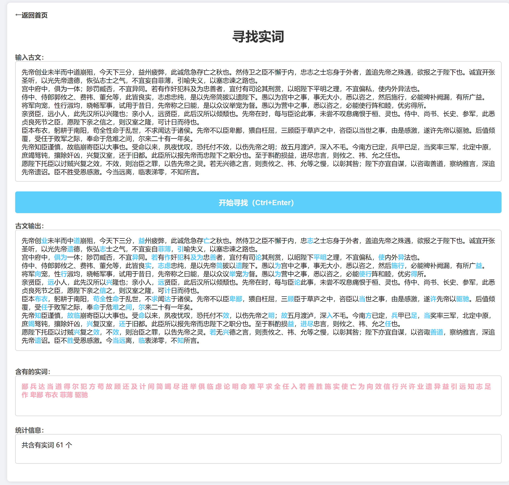

# 恨古人工具箱 ·  

一个基于静态网页的工具箱，可以帮助同学们更高效地学习。

----
ℹ 我们亲爱的[恨古人](https://www.zhihu.com/people/li-xuan-58-81)老师已经了解此项目，并对此高度重视，提出重要指示

### 功能介绍
网页链接：[henguren.lsc7.top](https://henguren.lsc7.top)
#### 寻找实词
根据上海中考的150个实词要求找寻古文中的实词

#### 文学常识
《评价指南》要求的的文学常识

----
### 开发计划
- [ ] 实词增加释义功能
- [ ] 文学常识支持分类筛选检索
- [ ] 文学常识增加作者
- [ ] 实词增加API功能

以上内容承诺完成日期：null

### 贡献想法
如果你有建议或意见，欢迎提Issue或PR，当面找我不一定会答应:)

### 许可证
本项目许可证为 [MIT LICENSE](LICENSE)
